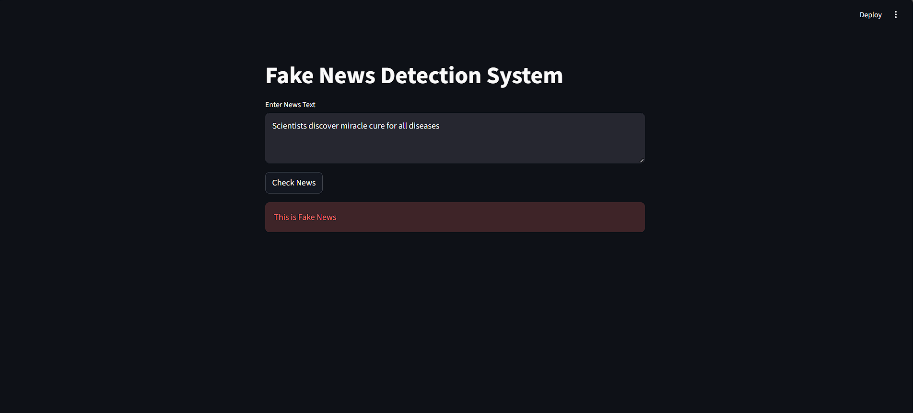

# 📰 Fake News Detection using Machine Learning


## 📌 Project Overview

Fake news spreads rapidly on social media and news platforms, causing misinformation and confusion.

This project uses **Machine Learning and Natural Language Processing (NLP)** to detect whether a news article is **Real or Fake**.

The model is trained on a large dataset of news articles and predicts the authenticity of new news content.

---

## 🚀 Features

* Detects **Fake vs Real News**
* Uses **TF-IDF text vectorization**
* Trained with **Logistic Regression**
* Built using **Python & Scikit-learn**
* Interactive **Streamlit Web App**
* Real-time news prediction

---

## 📊 Dataset

Dataset used:

**Fake and Real News Dataset**

🔗 https://www.kaggle.com/datasets/clmentbisaillon/fake-and-real-news-dataset

Dataset contains:

* 44,000+ news articles
* Real news
* Fake news
* Title and full article text

---

## 🧠 Machine Learning Pipeline

Dataset
↓
Text Preprocessing
↓
TF-IDF Vectorization
↓
Logistic Regression Model
↓
Prediction
↓
Streamlit Web Application

---

## 🛠 Tech Stack

* Python
* Pandas
* NumPy
* Scikit-learn
* NLP (Text Processing)
* Streamlit
* Jupyter Notebook

---

## 📈 Model Performance

Accuracy achieved:

**94% – 96%**

Evaluation metrics used:

* Accuracy Score
* Confusion Matrix
* Classification Report

---

## 📂 Project Structure

```
Fake-News-Detection
│
├── datasets
│   ├── Fake.csv
│   ├── True.csv
│
├── fake_news_detection.ipynb
├── train_model.py
├── app.py
├── model.pkl
├── vectorizer.pkl
├── requirements.txt
└── README.md
```

---

## ▶️ How to Run the Project

### 1️⃣ Clone the Repository

```
git clone https://github.com/YOUR_USERNAME/Fake-News-Detection.git
```

### 2️⃣ Install Dependencies

```
pip install -r requirements.txt
```

### 3️⃣ Run the Streamlit App

```
streamlit run app.py
```

---

## 🖥 Example Prediction

Input:

```
Scientists claim miracle fruit cures all diseases overnight
```

Output:

```
⚠ Fake News
```

---

## 📸 Application Interface



---

## 🔮 Future Improvements

* Use **BERT for better NLP accuracy**
* Add **confidence score**
* Build **Chrome Extension for fake news detection**
* Deploy online using **Streamlit Cloud**

---

## 👨‍💻 Author

**Hydra**

Machine Learning Enthusiast
Interested in **AI, NLP, and Data Science**

---

⭐ If you like this project, consider giving it a **star on GitHub**.
